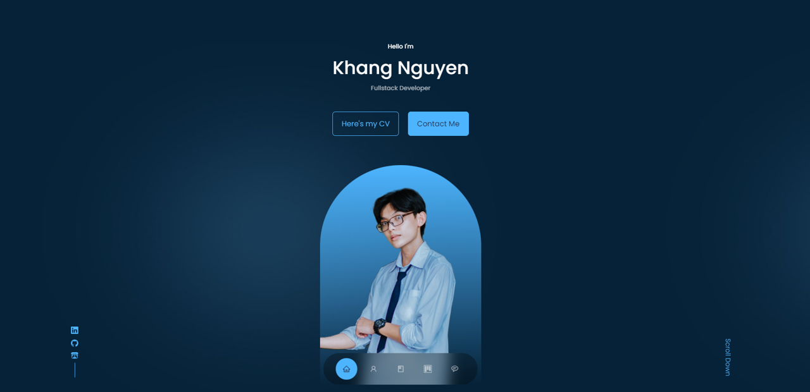

# React Portfolio Website
This project showcases my work and skills as a full-stack developer.

## Features

- **Portfolio Showcase:** Display completed projects, skills, and experiences in an organized and visually appealing manner.
- **Responsive Layout:** Portfolio website looks great and functions well across various devices, including desktops, tablets, and mobile phones.
- **Project Details:** Provide comprehensive information about each project, including descriptions, technologies used, and links to live demos or GitHub repositories.
- **Contact and Connect:** Offer clear ways for visitors to get in touch, such as through email or social media links.
- **Navigation and Accessibility:** Implement intuitive navigation to help users easily explore different sections, and ensure accessibility for all users.
  
- [Live Demo](https://kudoo39.github.io/react-portfolio/)

## Installation and Usage

1. Clone the repository: `git clone https://github.com/Kudoo39/react-portfolio`
2. Navigate to the project directory: `cd react-portfolio`
3. Install dependencies: `npm install`
4. Run the app locally: `npm start`

## Technologies Used

- JavaScript
- React
- CSS

---

Feel free to explore the project and share your feedback. If you encounter any issues or have suggestions for improvement, please [create an issue](https://github.com/Kudoo39/react-portfolio/issues).
